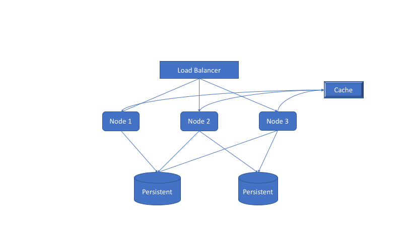

# Design a TinyURL System

## Clarification
LongerURL map to tinyUrl

Application Layer

## Design 

### Design diagram

### API - how to user interact with system
- CreateTiny: create(LongURL) -> tinyURL
- getURL: get(tinyURL) -> longURL

### Diagram
REST API/HTTP -> Load Balancer -> Application Server(Cache) -> Persistent

## Points

### Unique tinyURL
- tinyURL characters domain: all alphabetnumber characters(a-z, A-Z, 0-9), 62 characters
- how many chacracters you should use:
    * based on throughput n tps, and how many time you can support. 
      * Example: 1m tps and 3000 years, you can get 1m * 3000 * 366 * 24 * 3600 = 9.48672e16 urls, you ting url length shoudl at least log(62)(9.48672e16) = 10
- Schema
  key value map
  
### Technique
- Random key vs Counter
- Write consistency(Random)
  * Try to get tiny URL, if doesn't exist, put into database 
  * use put if absent(Relation DB)
  * put, then get and fecth
- Counter solution
  * Single host - By pendos or zookeeper.(Single point failure, performance)
  * All host - Based on the thoughput, every host maintains its own counter
  * Range solution - Distribute every 1m to one host, save the mapping into zookeeper
- Security 
  * Add random bit to end of every url or in position 1, 7, 13, 17, 23. then do Base64
  
- Hashing function
  * MD5
  * SHA1

### Cache
- [Redis]
- [MemCached]

### CDN
Different regions use CDN as cache.